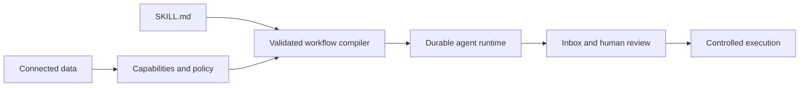

# Mandala

Mandala is a workspace for defining, running, and reviewing permissioned AI
workflows over connected business data.

It combines structured records, connectors, durable agent runs, human approval,
and controlled execution. Users describe a workflow in one versioned
`SKILL.md`; Mandala compiles that definition into a constrained runtime instead
of giving the model unrestricted access to data or actions.

## How it works



1. **Connect data** — integrations expose versioned capabilities such as
   reading records or creating a draft action.
2. **Define an agent** — a `SKILL.md` contains decision guidance plus a strict
   contract for data, rules, records, approvals, and allowed actions.
3. **Compile safely** — Mandala validates the file, resolves it against the
   workspace's installed connectors, and creates an immutable workflow version.
4. **Run durably** — the agent can investigate permitted evidence while
   LangGraph checkpoints preserve progress through retries and approval pauses.
5. **Review and act** — recommendations, evidence, warnings, and drafts appear
   in the Inbox. State-changing work remains policy-checked, approval-gated,
   auditable, and idempotent.

The model may interpret evidence and propose a course of action. It cannot add
tools, widen permissions, bypass deterministic safeguards, approve its own
draft, or access connector credentials.

## Product surfaces

- **Terminal client** — guided menus for the Inbox, reviews, evidence,
  decisions, agent installation, Sandbox runs, activation, and rollback.
- **Web application** — authenticated workspace for pages, collections,
  records, imports, settings, and future visual workflow surfaces.
- **Shared control plane** — both clients use the same tenant-aware APIs,
  workflow records, policies, approvals, and audit history.
- **Skill runtime** — reusable compiler and graph runtime with no
  workflow-name routing or workflow-specific execution privileges.

## Safety model

An agent receives only the intersection of:

- capabilities requested by its compiled skill;
- capabilities offered by an installed connector version;
- workspace grants and field-level policy;
- current connector health and schema compatibility; and
- the acting user's role.

Unknown skill fields, arbitrary operations, schema drift, missing grants,
unhealthy connectors, and unapproved writes fail closed. Activated versions
and their capability bindings are immutable so a run can always be explained
from the version that produced it.

## Repository layout

```text
apps/web/                 Next.js application, APIs, compiler, and runtime
apps/cli/                 Interactive terminal client and scripted commands
packages/control-plane/   Shared request and response contracts
skills/                   Installable example workflow definitions
supabase/migrations/      Tenant, workflow, capability, and record schemas
supabase/tests/           Database authorization and behavior tests
seed/                     Local workspace and connector seed data
```

The included skills are examples of the generic contract:

- `skills/procurement-reorder/SKILL.md`
- `skills/sales-spike-investigator/SKILL.md`

They compile through the same capability resolver and runtime. The second skill
exists specifically to prove that a new workflow does not need its own API
route, database tables, or runtime branch.

## Technology

- Next.js 15, React, shadcn/ui, and Plate.js
- Supabase Auth, Postgres, Storage, and Row-Level Security
- LangGraph for durable workflow execution and approval checkpoints
- LangSmith for optional tracing and evaluation
- Turborepo, pnpm workspaces, TypeScript, Vitest, and Playwright

## Local development

Prerequisites:

- Node.js 22 or newer
- pnpm
- Docker
- Supabase CLI

Start the local stack:

```bash
pnpm install --frozen-lockfile
supabase start
supabase db reset
cp .env.example apps/web/.env.local
pnpm seed
pnpm db:types
pnpm dev
```

In Windows PowerShell, use
`Copy-Item .env.example apps/web/.env.local` instead of `cp`. The remaining
commands are the same.

Populate the local Supabase values in `apps/web/.env.local` from
`supabase status`. The Web application runs at <http://localhost:3000> and the
local email inbox runs at <http://127.0.0.1:54324>.

The seed command creates a local user and workspace and prints the development
login details. Do not reuse those credentials outside the local environment.

## Terminal client

Build and link the `mandala` command:

```bash
pnpm cli:link
mandala auth login --email seed@example.com
```

On macOS and Linux, the command is linked into `~/.local/bin`. On Windows it is
created in `%LOCALAPPDATA%\Mandala\bin`. Add that directory to `PATH`, or set
`MANDALA_BIN_DIR` to a directory already on `PATH`, before running
`pnpm cli:link`. To use the default location immediately in PowerShell:

```powershell
$env:Path += ";$env:LOCALAPPDATA\Mandala\bin"
mandala
```

Windows stores Mandala's local config and session under
`%APPDATA%\Mandala`. macOS uses Application Support and Linux uses the XDG
config directory. Windows login tokens are encrypted for the current Windows
account using the operating system's Data Protection API.

Open [local Inbucket](http://127.0.0.1:54324), open the newest message for `seed@example.com`, and follow its magic link while the CLI is waiting. Then start the conversational terminal:

```bash
mandala
```

If `~/.local/bin` is not on `PATH` on macOS or Linux, add it to your shell
configuration or set `MANDALA_BIN_DIR` before running `pnpm cli:link`.

The terminal guides interactive users through authentication and workspace
selection. For automation, equivalent scripted commands remain available.

Useful interactive entry points:

- `/inbox` — review work that needs attention;
- `/agents` — validate, install, test, activate, deactivate, or restore agents;
- `/workspace` — inspect or change the active workspace;
- `/fixtures` — create local Sandbox scenarios; and
- `/help` — show commands valid for the current context.

For a hosted backend, set the public CLI endpoint and Supabase client values in
the shell. Service-role credentials, connector credentials, model credentials,
workflow database URLs, and signing secrets are server-only.

## Agent configuration

The default local experience works without enabling model-backed parsing.
Optional model reasoning, conversational parsing, and tracing are configured
with server-only values documented in `.env.example`, including:

- `AI_GATEWAY_API_KEY` or a supported hosted identity token;
- `MANDALA_TEST_AGENT_ENABLED` and `MANDALA_TEST_AGENT_MODEL`;
- `MANDALA_CONVERSATIONAL_PARSER_ENABLED`;
- `MANDALA_CONTROL_INPUT_HASH_KEY` and
  `MANDALA_CONTROL_BINDING_SECRET`; and
- the `LANGSMITH_*` tracing settings.

Durable checkpoints use the local Supabase database automatically. Hosted
environments must set `MANDALA_WORKFLOW_DATABASE_URL`. Initialize the checkpoint
schema explicitly with:

```bash
pnpm --filter web workflow:checkpoint:setup
```

The repository ships with a synthetic connector and generated business data
for Sandbox evaluation. Included state-changing actions are mock-only; adding a
live connector requires an explicit capability definition, workspace grant,
policy, approval path, and controlled executor.

## Validation

Run the checks closest to the changed surface:

```bash
pnpm --filter web typecheck
pnpm --filter web lint
pnpm --filter web test

pnpm --filter @workspace/cli typecheck
pnpm --filter @workspace/cli lint
pnpm --filter @workspace/cli test

supabase test db
supabase db lint --local --level warning
pnpm test:e2e
pnpm --filter web build
```

## Documentation and contribution

- Shared contributor instructions live in `AGENTS.md` and `CLAUDE.md`.
- Engineering documentation lives in `docs/`.
- The original workspace specification is in
  `docs/superpowers/specs/2026-04-28-backdesk-v1-design.md`.
- Codex workflow artifacts belong under
  `docs/codex/runs/<date>-<feature>/` and should not be merged unless they are
  intentionally durable.

To preview the Mintlify documentation locally:

```bash
cd docs
npx mintlify@latest validate
npx mintlify@latest dev
```
